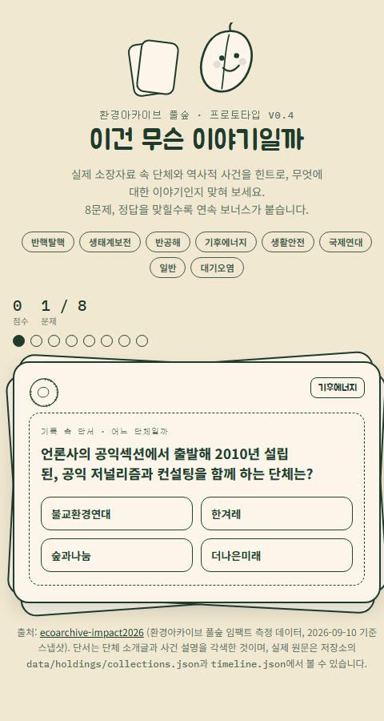

# 이건 무슨 이야기일까

환경아카이브 풀숲의 실제 소장자료를 힌트로, 어느 단체 또는 어떤 역사적 사건에 대한 이야기인지 맞히는 웹 퀴즈 보드게임 프로토타입입니다.

**🎮 바로 플레이하기: [ecojh8190-collab.github.io/eco-boardgame](https://ecojh8190-collab.github.io/eco-boardgame/)**



## 플레이 방법

- 카드에 적힌 단서를 읽고, 4개 보기 중 정답을 고릅니다.
- 8문제가 출제되며, 문제마다 "단체" 또는 "역사적 사건" 중 하나를 다룹니다.
- 정답을 맞히면 점수가 오르고, 연속으로 맞히면 보너스 점수가 붙습니다.
- 8문제를 모두 풀면 점수와 정답 수, 최고 연속 기록이 표시됩니다.

## 데이터 출처

문제와 힌트는 [ArchivelabEdu/ecoarchive-impact2026](https://github.com/ArchivelabEdu/ecoarchive-impact2026) 저장소의 실제 데이터를 각색해 만들었습니다.

- `data/holdings/collections.json` — 환경단체 34개 컬렉션의 소장자료 통계
- `data/holdings/timeline.json` — 40년간의 환경운동사 속 사건 47건

## 실행 방법

위 링크로 바로 플레이하거나, `index.html`(또는 `prototype-v0.html`) 파일을 브라우저로 열면 로컬에서도 바로 플레이할 수 있습니다. 별도의 빌드나 서버가 필요 없습니다.

## 폴더 구조

```
ecoboardgame/
├─ index.html           GitHub Pages 배포용 (prototype-v0.html과 동일)
├─ prototype-v0.html    퀴즈 게임 본체 (HTML/CSS/JS 단일 파일)
├─ docs/screenshot.png  대표 화면 스크린샷
└─ uploads/             디자인 시안 참고 이미지 (비공개, .gitignore 처리)
```
